**Manual Técnico:**

**OBJETIVO:** Proporcionar una guía para el lector, del desarrollo de la interfaz y de la instalación de la aplicación BINAES.

**REQUERIMENTOS DE FUNCIONAMIENTO** 

|**REQUERIMENTOS**|**DESCRIPCION**|
| :- | :-: |
|**JETBRAINS**|Se recomienda el uso de Jetbrains 2022.1.2 que fue la versión donde se programó la aplicación.|
|**WINDOWS 10 O 11**|Se recomienda el uso de Windows 10 o 11 que fue la versión donde se programó la aplicación.|
|**.NET FRAMEWORK 4.8**|
Se recomienda el uso de la versión 4.8 de Net Framework

para no tener dificultades a la hora de ejecutar la aplicación 

|
|**QRCODER.1.4.3**|Se recomienda el uso de la librería QRCORDER.1.4.3 para no tener dificultades a la hora de generar el código QR|

**INSTALACION JETBRAINS** 

[**https://www.jetbrains.com/es-es/rider/**](https://www.jetbrains.com/es-es/rider/)

Lo primero que deben de hacer es ingresar al link anterior, una vez hecho esto antes de darle descargar Rider y guardarlo.

Empezamos la instalación de JETBRAINS entonces le damos clic en el setup para iniciar la instalación nos aparecerá esta ventana donde le daremos siguiente.

Después nos aparecerá esta ventana mostrando en que disco se instalará por motivos de permisos se recomienda dejarlo en el disco c, le damos siguiente.

Después nos aparecerá esta ventana donde nos muestra los componentes que se van a instalar, todos los componentes son necesarios entonces le daremos siguiente. (Aunque importante recalcar que si tienes un sistema de 32 bits seleccionar el 32-bit-launcher)

Después nos aparecerá esta ventana mostrando como queremos llamar el shortcuts (se recomienda dejarlo así, pero pueden poner como quieran) le damos instalar.

Por último, esta ventana es el final del proceso donde le daremos terminar para acabar la instalación del programa (Aquí se selecciona reiniciar mas tarde, pero ustedes pueden reiniciar en el mismo momento si prefieren)

**INSTALACION WINDOWS 10**

<https://www.microsoft.com/es-es/software-download/windows10>

Para instalar Windows 10 desde cero, lo primero que debemos hacer es descargar Windows 10 desde el siguiente enlace. Microsoft nos permitirá descargar directamente desde sus servidores una imagen ISO de la última versión del sistema operativo.

Aceptamos los términos de licencia y continuamos. El programa se preparará para la creación del medio de instalación.

Tras unos segundos, el programa nos preguntará qué queremos hacer, si actualizar nuestro equipo (si no tenemos la última versión de Windows 10 instalada) o crear un medio de instalación para otro equipo. En nuestro caso seleccionamos esta segunda opción para continuar.

En el siguiente paso podemos personalizar el medio de instalación de nuestro Windows. Podemos, por ejemplo, cambiar el idioma, la edición o la arquitectura del Windows que vamos a instalar. Por defecto nos cargará la configuración actual de nuestro sistema.

Continuamos con el asistente y, en el siguiente paso, nos preguntará qué tipo de medio vamos a usar. Desde aquí podemos también descargar la ISO, igual que hemos visto antes, desde los servidores de Microsoft o crear una unidad Flash USB para instalar Windows 10 desde ella.

Seleccionamos esta primera opción y pulsamos Siguiente para continuar. En el siguiente paso, el asistente buscará las unidades USB conectadas a nuestro ordenador y nos las mostrará en la lista. Elegiremos la que corresponda a la memoria USB donde copiaremos Windows 10 (con cuidado, ya que el proceso borrará todos los datos ya existentes) y pulsaremos sobre «Siguiente» para comenzar con el proceso.

El asistente descargará la última versión de Windows 10 desde los servidores de Microsoft y la copiará a la memoria USB escogida para convertirla en una memoria de instalación. Este proceso puede tardar varios minutos, por lo que esperamos con calma a que finalice.

Una vez finalice todo el proceso, ya tendremos nuestra memoria USB lista para poder instalar Windows 10 desde ella en nuestro ordenador. La extraemos del ordenador y nos preparamos para continuar.

Lo siguiente que debemos hacer es introducir la memoria USB en el ordenador apagado y encenderlo. Salvo que tengamos la BIOS/UEFI de nuestro ordenador configurada para arrancar primero desde dispositivos extraíbles como memorias USB, debemos pulsar durante el arranque la tecla F8 repetidas veces (o equivalente, según modelos de placas base) para que nos aparezca el menú de Boot y seleccionar en él nuestro USB con Windows 10 para instalar.

Cuando el sistema intente arrancar desde la memoria USB, lo primero que veremos será un mensaje que nos pedirá que pulsemos una tecla cualquiera para empezar con la instalación de Windows 10.

Pulsamos cualquier tecla, y empezará una ventana de carga durante la cual se cargará en la memoria todo lo necesario para arrancar el asistente de instalación.

Tras esta ventana de carga, que dura unos segundos, veremos la ventana inicial del asistente de instalación de Windows 10.

En esta ventana debemos configurar el idioma de nuestro sistema operativo, el formato de hora y moneda y el tipo de teclado que vamos a utilizar.

Pulsamos sobre «Siguiente» y en la nueva ventana que aparece pulsaremos sobre «Instalar ahora«.

El asistente de instalación de Windows dedicará unos segundos a preparar la instalación.

El siguiente paso que nos pedirá el asistente será introducir el número de licencia de nuestro Windows. Si la licencia se encuentra grabada en la BIOS/UEFI de nuestro ordenador, esta ventana no la veremos. De lo contrario, si la tenemos a mano podemos introducirla o, si no, pulsamos sobre «No tengo clave de producto» para continuar sin dicha licencia.

A continuación, el asistente nos preguntará por la versión de Windows 10 que queremos instalar. Debemos elegir la que corresponda a nuestra licencia para evitar problemas.

Pulsamos de nuevo sobre Siguiente y aparecerán los términos de licencia, los cuales aceptaremos para continuar.

La siguiente ventana es una de las más importantes. En ella elegiremos el tipo de instalación que queremos:

Si queremos actualizar Windows y no perder los datos ni aplicaciones, elegiremos «Actualización».

Para una instalación limpia, elegiremos «Personalizada».

En nuestro caso seleccionamos la segunda opción, personalizada, y veremos un nuevo paso en el asistente donde elegir la partición del disco duro donde instalaremos Windows.

Si queremos crear particiones, pulsaremos sobre «Nuevo» y configuraremos el espacio que queremos utilizar para nuestro Windows. Si no hacemos nada, el asistente utilizará automáticamente todo el espacio para instalar Windows (y crear la partición de recuperación de 500 MB). En la segunda imagen podemos ver las particiones que crea por defecto Windows para poder arrancar y funcionar.

Después de formatear para instalar Windows 10, pulsamos sobre «Siguiente» y comenzará el proceso de instalación. Durante este proceso se llevarán a cabo una serie de tareas:

Copia de todos los archivos de instalación al disco duro.

Preparar los archivos para la instalación.

Instalar características de Windows.

Instalar actualizaciones incluidas en el medio se instalación.

Finalizar instalación.

Debemos esperar a que finalice el proceso de instalación. Durante el cual, el ordenador se reiniciará varias veces y, además, veremos distintas fases, tanto del asistente de instalación como de la configuración inicial de nuestro Windows 10.

Una vez finalice la instalación y los preparativos previos para Windows 10, veremos un asistente de configuración inicial desde el que tendremos que configurar nuestro sistema operativo.

Lo primero que aparecerá en este asistente de configuración será Cortana, el asistente personal. Puede que incluso nos asuste, porque empezará hablando.

A continuación, lo que debemos configurar en Windows 10 es la región del sistema operativo, así como la distribución del teclado que vamos a usar. Además, el asistente nos permitirá añadir otras distribuciones de teclado, en caso de usarlas. Si no vamos a añadir otras distribuciones de teclado, entonces haremos clic sobre «Omitir» para continuar.

Configuración de red

El asistente de configuración de Windows 10 se encargará a continuación de realizar una serie de configuraciones, como, por ejemplo, de la red. Si estamos conectados por cable, el asistente se conectará automáticamente a Internet. Si lo hacemos por Wi-Fi, veremos una lista con todas las redes, y tendremos que elegir la nuestra.

Configuración de cuenta

Una vez conectados a la red, llega uno de los pasos más polémicos de Windows 10: iniciar sesión con una Cuenta Microsoft. Si tenemos la cuenta y vamos a usarla, podemos introducir nuestro correo y nuestra contraseña en este asistente para iniciar sesión. Si no tenemos una cuenta, podemos crear una nueva desde aquí.

El siguiente paso será crear un PIN para iniciar sesión. Gracias a él podremos iniciar más rápido con el código numérico en lugar de tener que escribir una y otra vez la contraseña, que, por seguridad, debería ser bastante larga.

Configuración de servicios de Microsoft

El siguiente paso nos permitirá elegir si queremos, o no, activar el historial de actividad. Esta función nos permite sincronizar todos nuestros ordenadores y dispositivos de manera que podamos continuar lo que estamos haciendo en uno de ellos en cualquier otro. Todo gracias a nuestra Cuenta Microsoft. Si no vamos a usarlo, podemos negarlo, que el proceso continuará igualmente.

También veremos una pantalla que nos permitirá instalar la aplicación «Tu teléfono», y configurar directamente Windows 10 de manera que podamos controlar nuestro móvil desde el PC.

A continuación, tendremos que elegir si queremos activar OneDrive para guardar todos los datos personales en la nube de Microsoft, o si queremos guardar los datos localmente en el PC.

Windows 10 también nos ofrecerá la posibilidad de instalar una versión de prueba de Office 365 en el sistema operativo, o comprar directamente la licencia de la suite.

A continuación, tendremos que elegir si queremos que Cortana sea nuestro asistente personal, o si queremos que el asistente digital quede desactivado. Si lo habilitamos, Cortana nos ayudará con recordatorios, nos ayudará a buscar cosas y, además, nos contará chistes malos. También podemos marcar la casilla que nos permitirá indicarle si queremos que responda automáticamente al comando de voz «Hola Cortana».

Configuración de privacidad

Y, para finalizar, ya solo nos quedan de configurar las distintas opciones de privacidad de Windows 10. Estas opciones son muy claras y explicativas, y nos permiten saber cómo y para qué usará Windows 10 nuestros datos. Según queramos, podemos permitírselo o impedir que acceda a estos datos.

Los puntos de privacidad de Windows 10 que configuraremos son:

Reconocimiento de voz.

Ubicación.

Encontrar mi dispositivo.

Enviar diagnósticos a Microsoft.

Mejorar escritura.

Obtener experiencias personalizadas.

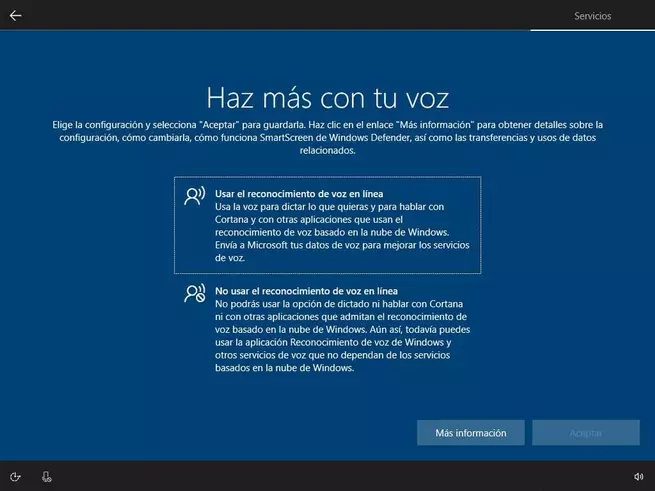Permitir a las aplicaciones usar el ID de publicidad.

Por supuesto, estas (y otras) opciones de privacidad se pueden configurar más adelante una vez instalado Windows 10.

Una vez configurado esto, el asistente de configuración terminará de preparar Windows 10 para nosotros.

Este proceso puede tardar unos minutos y, cuando finalice, ya podremos ver el escritorio de Windows. Ya hemos instalado Windows 10 desde cero.

**INSTALACION WINDOWS 11**

<https://www.microsoft.com/es-es/software-download/windows11>

Para instalar Windows 11 desde cero, lo primero que debemos hacer es descargar Windows 11 desde el siguiente enlace. Microsoft nos permitirá descargar directamente desde sus servidores una imagen ISO de la última versión del sistema operativo.

Instalación manual

Esta será la que nosotros llevemos a cabo, una instalación completamente limpia del sistema formateando el disco duro o partición para que no quede rastro de Windows 10. Tenemos la opción recomendada que será instalar la herramienta de creación de medios, que descarga la ISO y crea un USB Booteable. Una segunda opción sería descargar la ISO y con una herramienta externa como Rufus crear nosotros mismos el USB de instalación.

Aceptamos los términos de licencia y continuamos. El programa se preparará para la creación del medio de instalación.

Continuamos con el asistente y, en el siguiente paso, nos preguntará qué tipo de medio vamos a usar. Desde aquí podemos también descargar la ISO, igual que hemos visto antes, desde los servidores de Microsoft o crear una unidad Flash USB para instalar Windows 11 desde ella.

En el siguiente paso podemos personalizar el medio de instalación de nuestro Windows. Podemos, por ejemplo, cambiar el idioma, o la edición del Windows que vamos a instalar. Por defecto nos cargará la configuración actual de nuestro sistema.

El asistente descargará la última versión de Windows 11 desde los servidores de Microsoft y la copiará a la memoria USB escogida para convertirla en una memoria de instalación. Este proceso puede tardar varios minutos, por lo que esperamos con calma a que finalice.

Una vez finalice todo el proceso, ya tendremos nuestra memoria USB lista para poder instalar Windows 11 desde ella en nuestro ordenador. La extraemos del ordenador y nos preparamos para continuar.

Iniciar el USB booteable en el equipo

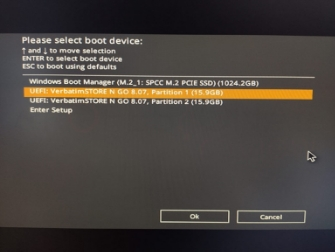El siguiente paso una vez creado el medio de instalación será conseguir que arranque el USB antes que nuestro disco duro para comenzar con el asistente de instalación. Dado que a estas alturas todos debemos tener un PC con BIOS UEFI como requisito indispensable para instalar Windows 11, el procedimiento se reduce en dificultad.

Asistente de instalación

Con el procedimiento anterior habremos conseguido finalmente acceder al menú de instalación de Windows 11.

En esta ventana debemos configurar el idioma de nuestro sistema operativo, el formato de hora y moneda y el tipo de teclado que vamos a utilizar.

Pulsamos sobre «Siguiente» y en la nueva ventana que aparece pulsaremos sobre «Instalar ahora «.

El siguiente paso que nos pedirá el asistente será introducir el número de licencia de nuestro Windows. Si la licencia se encuentra grabada en la BIOS/UEFI de nuestro ordenador, esta ventana no la veremos. De lo contrario, si la tenemos a mano podemos introducirla o, si no, pulsamos sobre «No tengo clave de producto» para continuar sin dicha licencia.

A continuación, el asistente nos preguntará por la versión de Windows 11 que queremos instalar. Debemos elegir la que corresponda a nuestra licencia para evitar problemas.

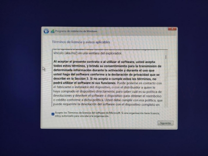Pulsamos de nuevo sobre Siguiente y aparecerán los términos de licencia, los cuales aceptaremos para continuar.

En nuestro caso seleccionamos la segunda opción, personalizada, y veremos un nuevo paso en el asistente donde elegir la partición del disco duro donde instalaremos Windows

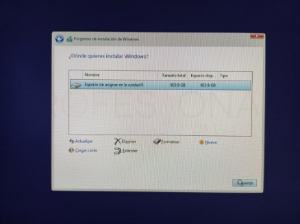Si queremos crear particiones, pulsaremos sobre «Nuevo» y configuraremos el espacio que queremos utilizar para nuestro Windows. Si no hacemos nada, el asistente utilizará automáticamente todo el espacio para instalar Windows (y crear la partición de recuperación de 500 MB). En la segunda imagen podemos ver las particiones que crea por defecto Windows para poder arrancar y funcionar.

La siguiente ventana es una de las más importantes. En ella elegiremos el tipo de instalación que queremos:

Si queremos actualizar Windows y no perder los datos ni aplicaciones, elegiremos «Actualización».

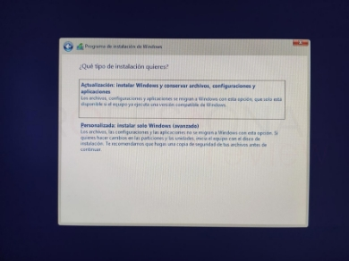Para una instalación limpia, elegiremos «Personalizada».

Elegimos una instalación personalizada para nosotros gestionar el disco duro desde el asistente que a parecerá a continuación. Mediante los controladores de ratón podremos eliminar todas las particiones e instalar una copia limpia en la unidad. En nuestro caso, no tenemos particiones de datos ni OEM al ser un SSD propio, pero cada cual deberá eliminar solo las particiones pertinentes o identificar la que tiene la instalación de Windows para hacer la nueva instalación sobre ella.

Como siempre, el sistema creará automáticamente varias particiones extras ocultas como la de reservado o recuperación para proceder a la instalación. El siguiente paso será ya configurar Windows 11 con el asistente de inicio.

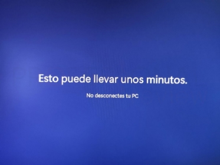Configuración inicial de Windows 11

Si la instalación ha sido correcta, el PC se reiniciará dos veces y aparecerá el asistente de configuración inmediatamente. Podremos comprobar que las fuentes y el estilo de presentación es mucho más bonito que antes, adaptándose a los nuevos tiempos.

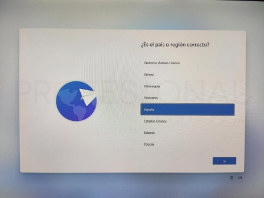A continuación, lo que debemos configurar en Windows 11 es la región del sistema operativo- 

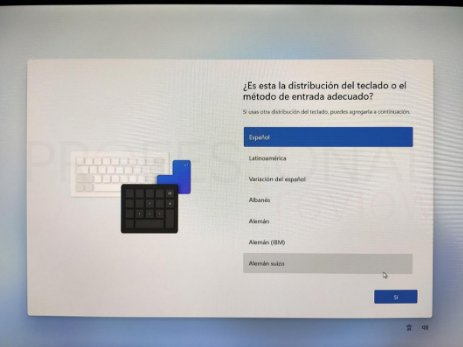A continuación, lo que debemos configurar en Windows 11 es la distribución del teclado que vamos a usar. Además, el asistente nos permitirá añadir otras distribuciones de teclado, en caso de usarlas. Si no vamos a añadir otras distribuciones de teclado, entonces haremos clic sobre «Omitir» para continuar.

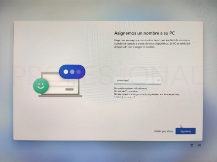A continuación, lo que debemos configurar en Windows 11 es el nombre que le vamos a asignar a nuestro PC.

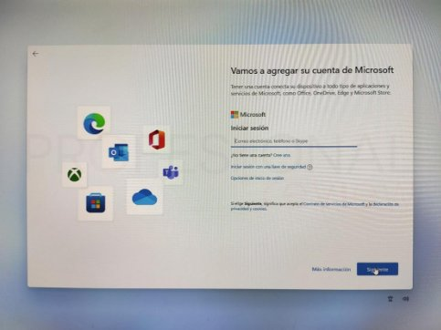A continuación, iniciar sesión con una Cuenta Microsoft. Si tenemos la cuenta y vamos a usarla, podemos introducir nuestro correo y nuestra contraseña en este asistente para iniciar sesión. Si no tenemos una cuenta, podemos crear una nueva desde aquí.

El siguiente paso será crear un PIN para iniciar sesión. Gracias a él podremos iniciar más rápido con el código numérico en lugar de tener que escribir una y otra vez la contraseña, que, por seguridad, debería ser bastante larga

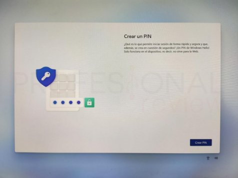

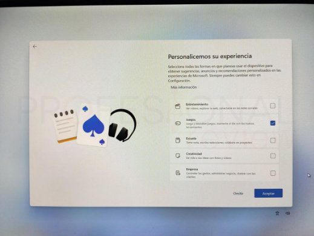El siguiente paso será personalizar su experiencia (Aquí queda a selección de cada uno como lo quiero personalizar) una vez listo le damos en aceptar

Una vez configurado esto, el asistente de configuración terminará de preparar Windows 11 para nosotros.

Este proceso puede tardar unos minutos y, cuando finalice, ya podremos ver el escritorio de Windows. Ya hemos instalado Windows 11 desde cero.

**INSTALACION .NET FRAMEWORK 4.8**

Enlace: <https://dotnet.microsoft.com/en-us/download/dotnet-framework>

Ingresar al link anterior y dar clic a la versión más reciente.

Descargar la opción de .net framework para Developer Pack, esto permite tener todos los accesos necesarios para desarrollar y programar correctamente.

Abrir el archivo y Aceptar los términos – Dar clic en Instalar

**INSTALACION QRCODER.1.4.3**

Abrimos Jetbrains y le seleccionamos donde dice NoGet

Una vez abierto escogemos la liberaría QRCoder.1.4.3

Y le damos en la casilla “+”

Manual de Usuario

de BINAES

**Índice**

Descripción general del software ------------------------------------------------ 3

Ingresar a la app --------------------------------------------------------------------- 4

Página principal ---------------------------------------------------------------------- 6

Tus datos personales --------------------------------------------------------------- 7

Buscar Ejemplares ------------------------------------------------------------------ 8

Ver eventos --------------------------------------------------------------------------- 10

Errores comunes -------------------------------------------------------------------- 11

1. **Descripción general del software**

Es un administrador de libros y eventos de la biblioteca nacional de El Salvador BINAES donde pueden acceder usuarios y administradores, estos administradores controlan el registro de usuarios nuevos en el sistema, ingresan sus datos personales y su foto para generarle un carnet con un código QR donde este se utilizara dentro de las instalaciones, también pueden eliminar los ejemplares si ya no se encuentran disponibles, crean, editan o eliminan eventos que se llevan a cabo, mientras que un usuario solo puede acceder a una vista general de la app, donde solo pueden ver los ejemplares en existencia, eventos a realizar, sus reservas y su información personal, el usuario no puede registrarse o agregar nuevos usuarios, tampoco puede reservar sin ayuda de un administrador.

1. # **Ingresar a la App**

1. Haz click en el botón ingresar.

1. Ingresa tu correo electrónico relacionado a tu cuenta.

1. Haz clic en el botón buscar para entrar a la app.

1. ` `Usa el botón regresar si no quieres ingresar.

1. Una vez ingresado el correo electrónico tomate tu tiempo para verificar si ha sido escrito correctamente.

1. Haz clic en el botón Ingresar para proceder.

## **3. Página principal**

Una vez haz ingresado a la página principal se te mostrará lo siguiente:

1. **Ejemplares:** en este apartado tu puedes consultar si el libro que buscas está disponible.

1. **Eventos:** Si lo que buscas es asistir a un evento puedes usar este apartado y te mostrará los próximos eventos.

1. **Tu cuenta:** Aquí puedes consultar tus datos personales como también una imagen de ti.

1. **Tus préstamos:** Si lo que quieres es saber sobre tus prestamos realizados los podrás ver en este apartado.

#### **4. Tus datos personales**

En el apartado de “Tu cuenta” puedes ver tus datos personales:

1. Haz clic en el botón de “Tu cuenta” para abrir o cerrar este apartado

1. Aquí aparecerá tu imagen que será la misma del carnet.

1. Aquí aparece tu nombre registrado

1. Aquí aparecerá tu correo registrado

1. Aquí aparecerá tu número de teléfono registrado

**
#### **5. Buscar Ejemplares**

1. Haz clic en “Ejemplares” Para abrir la lista de búsqueda

1. Haz clic sobre la barra y escribe el nombre del libro que buscas.

1. Haz clic en buscar para iniciar la búsqueda.

1. Aquí puedes filtrar tu búsqueda por autor.

1. Puedes seleccionar si lo quieres en formato físico o digital.

1. Haz clic en el botón “Filtrar” para comenzar la búsqueda.

1. Aquí aparecerá tu lista con los resultados obtenidos.

1. Aquí aparecerá una imagen de portada como referencia del libro seleccionado.

1. ##### **Ver Eventos**

1. Haz clic en el botón “Eventos”.

1. Aquí puedes ver un listado de los eventos próximos a realizar, así como su fecha y hora de inicio para que puedas asistir.

1. En este apartado se te mostrará un pequeño banner de la temática a realizar.

1. ###### **Cuadro de errores comunes** 

|**Error**|**Descripción**|
| :- | :- |
||
**Error formato de correo electrónico inexistente o formato incorrecto**: Asegúrate que el correo ingresado sea el proporcionado por un administrador en el momento de creación de tu cuenta.

|

